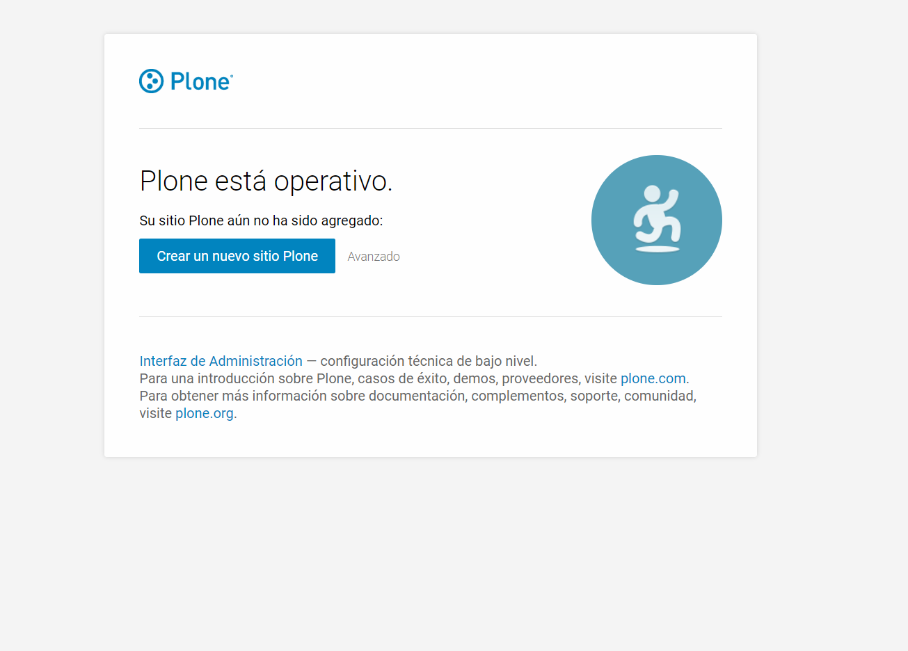

### Receta para instalación de webpack en Plone

Primero se crea el proyecto ejecutando el siguiente comando 

~~~bash
$ git clone http://gitlab.sct.gob.mx/hvelarde/elmirador
~~~

Creamos un entorno virtual para tener mayor control sobre el ambiente:
~~~bash
$ virtualenv pydev
~~~

Acceder al entorno virtual para su uso

~~~bash
source pydev/bin/activate
~~~
Debería tener una estructura como la siguiente:

~~~bash
(pydev)$ ls
bootstrap.py  CHANGES.rst       development.cfg  etc             README.rst  setup.py
buildout.d    CONTRIBUTORS.rst  docs             production.cfg  setup.cfg   src
~~~
Ahora procedemos a hacer la construccion de Plone
~~~bash
(pydev)$ python bootstrap.py -c development.cfg
~~~

Agregar las siguientes lineas en el archivo "development.cfg"(para desarollo. En produccion modificar "production.cfg")

~~~bash
    [buildout]
        ...
    parts +=
        node
        staticresources

    [node]
    recipe = gp.recipe.node
    version = 8.11.2
    npms = npm yarn
    scripts = npm yarn

    [staticresources]
    recipe = sc.recipe.staticresources
    name = sct.elmirador
    short_name = sctelmirador
~~~

Salimos del entorno virtual 
~~~bash
(pydev)$ deactivate
~~~
Ahora ejecutamos el script para la construcción de los componenetes de Plone con los cambios hecho en el archivo de configuración(development.cfg)
~~~bash
$ bin/buildout -c development.cfg
~~~
Despues de esto, debera obtener una salida como esta en el directorio "bin" de su proyecto
~~~bash
$ls
buildout                      code-analysis-dependencychecker  coverage            test
build-sctelmirador            code-analysis-find-untranslated  createcoverage      test-sctelmirador
check-manifest                code-analysis-flake8             debug-sctelmirador  versioncheck
checkversions                 code-analysis-importchecker      dependencychecker   watch-sctelmirador
code-analysis                 code-analysis-jscs               env-sctelmirador    yarn
code-analysis-chameleon-lint  code-analysis-jshint             flake8              zopepy
code-analysis-check-manifest  code-analysis-scsslint           instance
code-analysis-clean-lines     code-analysis-xmllint            node
code-analysis-csslint         code-analysis-zptlint            npm
~~~

hasdkjasdh
